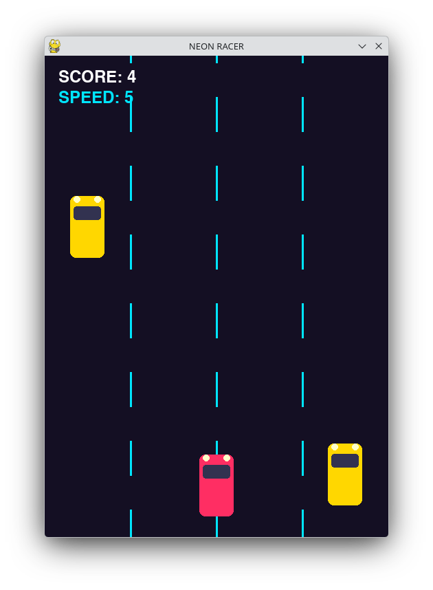

# Introduction

This is car racing game.

# Screenshot




# Run the game 

## python version

```sh
# make sure pygame is installed
pip install pygame

python car.py
```

## cpp version

```sh
# make sure sfml is installed
sudo pacman -Sy sfml # for arch linux

g++ car.cpp -ocar_racing -lsfml-graphics -lsfml-window -lsfml-system
./car_racing
```