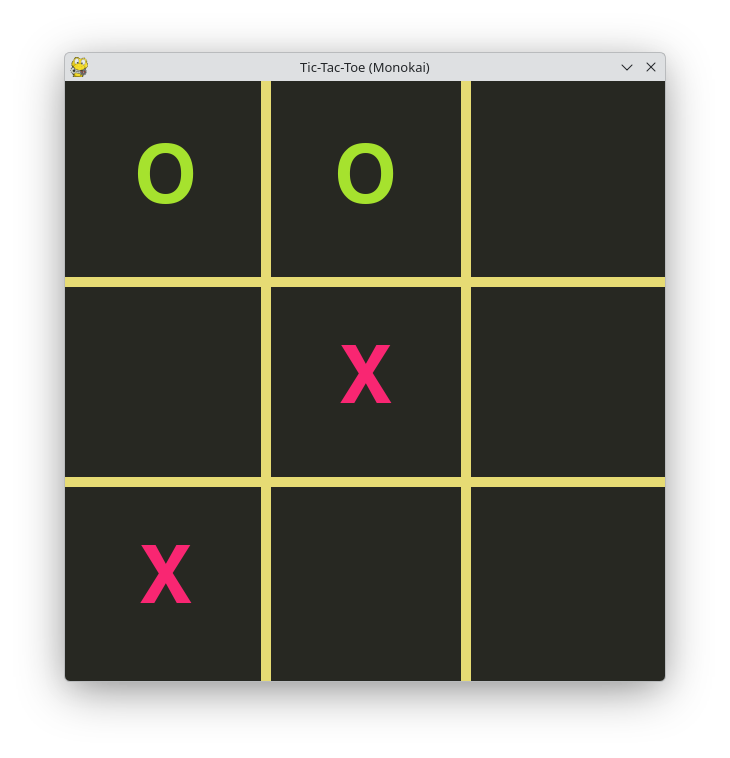

# Introduction

This is tic-tac-toe game.

# Screenshot




# Run the game 

## python version

```sh
# make sure pygame is installed
pip install pygame

python tic-tac-toe.py
```

## cpp version

```sh
# make sure sfml is installed
sudo pacman -Sy sfml # for arch linux

g++ tic-tac-toe.cpp -otic-tac-toe -lsfml-graphics -lsfml-window -lsfml-system
./tic-tac-toe
```

# TODO
fix cpp version